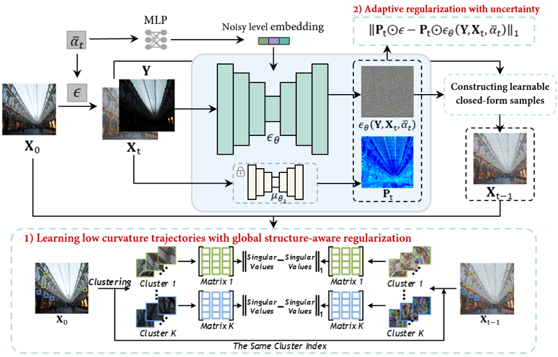

# [NeurIPS 2023] Global Structure-Aware Diffusion Process for Low-Light Image Enhancement

### [Paper](https://arxiv.org/abs/2310.17577) | [Project Page](https://github.com/jinnh/GSAD) |

## Overall

<div align="left">
	
</div>

## Evaluation

<div align="left">
	
</div>
We also provide the pre-trained models and visual results.

| Dataset | Checkpoints | Outputs |
|:---:|:---:|:---:|
| [LOLv1](https://daooshee.github.io/BMVC2018website/) | [ckpt](https://drive.google.com/drive/folders/1KLPm2oOg2Fx4WlbnOXMjN2rbyzzG8Hd-?usp=drive_link) | [images] |
| [LOLv2-real](https://github.com/flyywh/CVPR-2020-Semi-Low-Light)| [ckpt](https://drive.google.com/drive/folders/1KLPm2oOg2Fx4WlbnOXMjN2rbyzzG8Hd-?usp=drive_link) | [images] |
| [LOLv2-syn](https://github.com/flyywh/CVPR-2020-Semi-Low-Light)| [ckpt](https://drive.google.com/drive/folders/1KLPm2oOg2Fx4WlbnOXMjN2rbyzzG8Hd-?usp=drive_linkg) | [images] |

## Citation

If you find our work useful for your research, please cite our paper

```
@article{hou23global,
  title={Global Structure-Aware Diffusion Process for Low-Light Image Enhancement},
  author={Jinhui Hou, Zhiyu Zhu, Junhui Hou, Hui Liu, Huanqiang Zeng, and Hui Yuan},
  journal={Advances in Neural Information Processing Systems},
  year={2023}
}
```

## Acknowledgement

Our code is partly built upon [SR3](https://github.com/Janspiry/Image-Super-Resolution-via-Iterative-Refinement). Thanks to the contributors of their great work.
